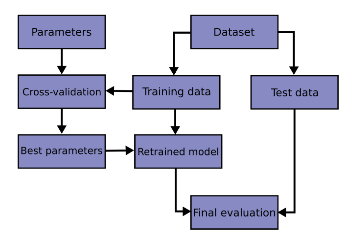
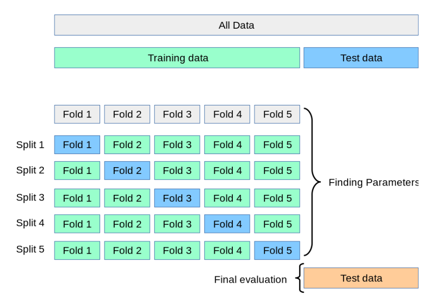

transformer --> estimator
https://scikit-learn.org/stable/getting_started.html

 <br>

made with https://excalidraw.com   <br>


model_selection: cross_validation, KFold,
```kfold = KFold(3, True, 1)```
>split data into 3 parts \
>True for shuffling the data \
>1 for pseudorandom number genertor \
https://machinelearningmastery.com/k-fold-cross-validation/


>! KFold can be
> - Stratified: ensuring that each fold has the same proportion of observations with a given categorical value
> - Repeated: the data sample is shuffled prior to each repetition. The split of data is different each time.
> - Nested: This is where k-fold cross-validation is performed within each fold of cross-validation, often to perform hyperparameter tuning during model evaluation. This is called nested cross-validation or double cross-validation.

## Example
``` python
# scikit-learn k-fold cross-validation
from numpy import array
from sklearn.model_selection import KFold
# data sample
data = array([0.1, 0.2, 0.3, 0.4, 0.5, 0.6])
# prepare cross validation
kfold = KFold(3, True, 1)
# enumerate splits
for train, test in kfold.split(data):
	print('train: %s, test: %s' % (data[train], data[test]))
```

```
train: [0.1 0.4 0.5 0.6], test: [0.2 0.3]
train: [0.2 0.3 0.4 0.6], test: [0.1 0.5]
train: [0.1 0.2 0.3 0.5], test: [0.4 0.6]
```

## Nested vs. Non-Nested Cross-Validation
https://scikit-learn.org/stable/auto_examples/model_selection/plot_nested_cross_validation_iris.html#sphx-glr-auto-examples-model-selection-plot-nested-cross-validation-iris-py

- Estimator: fitting and predicting
- Pipeline: Chaining preprocessor and estimator
-- Pipeline.fit
-- RandimizedSearchCV(pipeline, n_iter = xx, ...)
- Model evaluation
- Automatic parameter searches


### Cross-Validation Workflow

Grid search is used to find the best parameters
  
https://scikit-learn.org/stable/modules/cross_validation.html


K-Fold cross validation
